# BazarDriveCloud — карта экранов (screen map)

> **Тип документа:** документационная схема, не код. Ничего в приложении не меняется.
>
> **Источник правды:** маршруты сверены с `public/src/app.js` и `public/src/router.js`;
> контракты — с [`docs/screen-contracts.md`](screen-contracts.md), [`docs/flow-contracts.md`](flow-contracts.md),
> [`docs/active-ride-plan.md`](active-ride-plan.md), [`docs/design-registry.json`](design-registry.json) и [`ROADMAP.md`](../ROADMAP.md).
>
> **Дата снимка:** 2026-06-03 (ветка разработки `claude/clever-ritchie-LBRJ9`).

Документ отвечает на три вопроса:

1. Какие экраны **уже есть в коде** на сегодня.
2. Какие экраны **должны быть / запланированы**, но ещё не реализованы.
3. Как экраны связаны между собой по пользовательским сценариям (Mermaid-схемы).

Каждый экран в дисциплине проекта должен иметь: **Cloud Design render/frame → route → файл реализации → контракт данных/состояний → acceptance checklist** (см. диспетчерскую линию в `screen-contracts.md`).

> ⚠️ **Важное расхождение с исходным брифом.** Бриф задачи перечислял `MapHome`, `LocationPermission`,
> `RoutePicker`, `RoutePreview`, `OrderMapDraft`, `DriverMap` как «недостающие / запланированные».
> По факту в коде **все они уже реализованы** как mock-экраны (см. `app.js`). В таблице ниже они
> отнесены к **существующим**. Реально незакрытыми остаются: backend-аутентификация (`AuthPhone`),
> настоящий Mapbox SDK, два map-layer stub-модуля и полноценный driver no-show flow.

---

## A. Экраны есть сейчас

Все маршруты зарегистрированы в `public/src/app.js`. Роли: `passenger` / `driver` / `common` (любая роль) / `guest`.
Status: `implemented` (рабочий экран) / `partial` (есть, но с заглушками/незавершён) / `placeholder` (DOM-заглушка, без реальной логики).

| Screen ID | Название | Route | File | Role | Status | Notes |
|---|---|---|---|---|---|---|
| BD-ONBOARDING-01 (welcome) | Welcome | `/welcome` | `public/src/screens/welcome.js` | guest | implemented | First-run. Скрывает tabbar/FAB. |
| BD-ONBOARDING-01 | Onboarding | `/onboarding` | `public/src/screens/onboarding.js` | common / guest | implemented | Роль, телефон/OTP (mock), профиль, авто, документы. Pending-intent сохраняется. |
| BD-FEED-01 | Feed V2 | `/feed` | `public/src/screens/feed.js` | common | implemented | Единственный экран с FAB. Категории, CTA на respond/chat/accept. |
| BD-COMPOSER-01 | Composer V2 | `/new` | `public/src/screens/composer.js` | common | implemented | 5 типов публикаций, автосохранение `bazardrive.draft.v2`. |
| BD-PROFILE-01 | Profile (passenger) | `/profile` | `public/src/screens/profile.js` | passenger / guest | implemented | Дашборд пассажира, верификация телефона (mock). |
| BD-PROFILE-02 | Profile (driver) | `/profile` | `public/src/screens/profile.js` | driver | implemented | Overview / Taxi IP / Documents / Payouts / Safety; readiness через `isDriverLineReady()`. |
| BD-RULES-01 | Rules | `/rules` | `public/src/screens/rules.js` | common | implemented | Статический контент. |
| BD-MAP-01 | MapHome | `/map` | `public/src/screens/map.js` | passenger / common | placeholder | Mock map surface, **только** `createMapShell()`. Без Mapbox SDK. |
| BD-MAP-02 | LocationPermission | `/location-permission` | `public/src/screens/location_permission.js` | common | partial | Mock permission UX, не вызывает native prompt. |
| BD-MAP-03 | RoutePicker | `/route-picker` | `public/src/screens/route_picker.js` | passenger | implemented | Пишет `bazardrive.route_draft.v1`. |
| BD-MAP-04 | RoutePreview | `/route-preview` | `public/src/screens/route_preview.js` | passenger | implemented | Читает route draft, ETA/цена из mock-данных. |
| BD-MAP-05 | OrderMapDraft | `/order-map-draft` | `public/src/screens/order_map_draft.js` | passenger | implemented | Создаёт локальный заказ `bazardrive.ride_orders.v1`. |
| BD-DRIVER-01 / -02 | DriverMap | `/driver-map` | `public/src/screens/driver_map.js` | driver | partial | Mock-заказы. Role gate + readiness gate (`isDriverLineReady()`). MapShell placeholder. |
| BD-RESPOND-01 | Respond | `/respond?postId=…` | `public/src/screens/respond.js` | driver / passenger | implemented | Отклик/оффер на заявку из ленты. |
| BD-RESPONSES-01 | Responses inbox | `/responses` | `public/src/screens/responses.js` | passenger | implemented | Доска откликов: реальные отклики из `bazardrive.responses.v1` по `orderId` (read-side, #369) + `MOCK_DRIVERS` fallback; `getOrderById()` для заказа. |
| BD-CHAT-01 | Chat | `/chat?tripId=… \| ?responseId=…` | `public/src/screens/chat.js` | common | implemented | Один тред на trip/response, мост к confirmation/active ride. |
| BD-CONFIRM-01 | Trip Confirmation handoff | `/trip-confirmation` | `public/src/screens/trip_confirmation.js` | common | implemented | Мост чат → активная поездка. Скрывает chrome. |
| BD-RIDE-D-01..09 | Driver Active Ride | `/active-ride?role=driver` | `public/src/screens/active_ride.js` | driver | implemented | Жизненный цикл + cancel/problem/earnings sheets (in-screen). |
| BD-RIDE-P-01..07 | Passenger Active Ride | `/active-ride?role=passenger` | `public/src/screens/active_ride_passenger.js` | passenger | implemented | Тот же `tripId`, рендерится внутри `/active-ride`. cancel/safety sheets (in-screen). |
| BD-POST-01 | Post detail | `/post` | `public/src/screens/post_detail.js` | common | implemented | Детальная карточка, soft-fail на неизвестный id. |
| BD-INBOX-01 | Inbox hub | `/inbox` | `public/src/screens/inbox.js` | common | implemented | Responses / messages / rides. |

### Не-маршрутные модули (existing, но без своего route)

| ID | Название | File | Role | Status | Notes |
|---|---|---|---|---|---|
| BD-RIDE-F-02 | MapShell placeholder | `public/src/mapbox/map_shell.js` | common | placeholder | Reusable DOM map-заглушка. Без SDK/token/network. Используется map/driver-map/active-ride. |
| BD-CONFIRM-01 (helper) | Trip confirmation handoff loader | `public/src/screens/trip_confirmation_handoff.js` | common | implemented | Seed `/active-ride` из подтверждённого handoff. Без DOM/router. |
| BD-CONFIRM-01 (helper) | Driver handoff snapshot | `public/src/screens/driver_handoff_snapshot.js` | driver | implemented | TTL-снимок driver-side handoff + overlay на ride. Без DOM/router. |
| BD-RIDE-F-01 | Ride state contract | `public/src/ride_state.js` | common | implemented | Не экран: enum статусов + storage активной поездки. |

**Sheets / sub-states (не отдельный route, открываются внутри Active Ride):**

| ID | Название | Где | Status |
|---|---|---|---|
| BD-RIDE-D-CANCEL-01 | Driver Cancel | `active_ride.js` (`?status=CANCELED` или sheet) | implemented |
| BD-RIDE-D-SAFETY-01 | Driver Safety | `active_ride.js` (shield control) | implemented |
| BD-RIDE-D-PROBLEM | Driver Problem | `active_ride.js` (sheet) | implemented |
| BD-RIDE-D-EARNINGS | Driver Earnings | `active_ride.js` (sheet) | implemented |
| BD-RIDE-D-COMPLETE-01 | Driver Ride Complete | `active_ride.js` (`?status=COMPLETED`) | implemented |
| BD-RIDE-P-CANCEL-01 | Passenger Cancel | `active_ride_passenger.js` (`?status=CANCELED` или sheet) | implemented |
| BD-RIDE-P-SAFETY-01 | Passenger Safety | `active_ride_passenger.js` (shield control) | implemented |
| BD-RIDE-P-COMPLETE-01 | Passenger Ride Complete | `active_ride_passenger.js` (`?status=COMPLETED`) | implemented |

---

## B. Экраны должны быть / запланированы

Priority: `P0` (блокирует основной сценарий) / `P1` (важно для полноты mock-spine) / `P2` (будущая фаза).
Status: `missing` (нет ни рендера, ни кода) / `design-needed` (нужен Cloud Design render) / `contract-needed` (нужен контракт состояний) / `ready-for-dev` (render + контракт есть, можно кодить).

| Screen ID | Название | Планируемый route | Планируемый file | Зачем нужен | Зависимости | Priority | Status |
|---|---|---|---|---|---|---|---|
| BD-ORDER-DETAIL-01 | Order Detail | `/order/<id>` (планируем) | `public/src/screens/order_detail.js` (планируем) | Общий деталь-экран заказа, role-split passenger/driver. Сейчас отсутствует runtime route — пассажир/водитель видят разные куски заказа в feed/respond/responses/chat без единой точки входа. Контракт уже зафиксирован в `screen-contracts.md` (BD-ORDER-DETAIL-01), но рендер ещё не написан. | mock_api / responses store / active_ride store (читается read-only). Решение по семантике driver «Принять» зафиксировано как unresolved. | **P0** | missing / contract-gated (см. issue #454, audit #455) |
| BD-AUTH-PHONE-01 | AuthPhone | `/auth-phone` (предположит.) | `public/src/screens/auth_phone.js` | Реальный вход по телефону/OTP. Сейчас только mock внутри `onboarding.js`. | Backend (Telegram Login / magic-link), Phase 2 | P2 | missing / contract-needed |
| BD-MAP-FOUND-01 | Real Mapbox foundation (апгрейд MapHome/DriverMap/ActiveRide) | существующие `/map`, `/driver-map`, `/active-ride` | `public/src/mapbox/*` (новый слой) | Заменить MapShell placeholder на реальный Mapbox GL: тайлы, маршрут, live-position. | Mapbox SDK + token + CSP update + SW update; Phase 4 | P2 | missing / design-needed |
| BD-MAP-LAYER-01 | Driver markers layer | — (модуль, не экран) | `public/src/mapbox/driver_markers.js` | Слой маркеров водителей/заказов поверх карты. Указан в ROADMAP как отсутствующий stub. | Mapbox foundation | P2 | missing |
| BD-MAP-LAYER-02 | Trip status layer | — (модуль, не экран) | `public/src/mapbox/trip_status_layer.js` | Слой статуса поездки (маршрут/ETA) поверх карты. Отсутствующий stub. | Mapbox foundation | P2 | missing |
| BD-RIDE-D-NOSHOW-01 | Driver No-show full flow | `/active-ride?role=driver&status=NO_SHOW` (расширение) | `active_ride.js` | Сейчас no-show — только stub/toast путь. Нужен полноценный lifecycle-экран (таймер ожидания, подтверждение, компенсация). | Контракт ожидания/компенсации | P1 | design-needed / contract-needed |
| BD-CONFIRM-DRIVER-01 | DriverConfirm (выделенный экран) | `/driver-confirm` (опц.) | `public/src/screens/driver_confirm.js` | Сейчас driver-side handoff — это helper-модули без route. Выделенный экран подтверждения нужен только если продукт потребует явный UI-шаг. | `driver_handoff_snapshot.js`, `trip_confirmation` | P2 | contract-needed |
| BD-EARNINGS-01 | Earnings / Payouts (standalone) | `/earnings` (опц.) | `public/src/screens/earnings.js` | Сейчас earnings — sheet в active ride + вкладка Payouts в Profile. Отдельный экран истории выплат — будущая фаза. | Backend (реальные выплаты) | P2 | design-needed |

> **Примечание.** `MapHome`, `LocationPermission`, `RoutePicker`, `RoutePreview`, `OrderMapDraft`, `DriverMap`,
> passenger cancel/safety sheets, driver cancel/problem/earnings sheets — **уже существуют** (см. таблицу A) и поэтому
> здесь намеренно не повторяются как «missing».

---

## C. Пользовательский путь пассажира

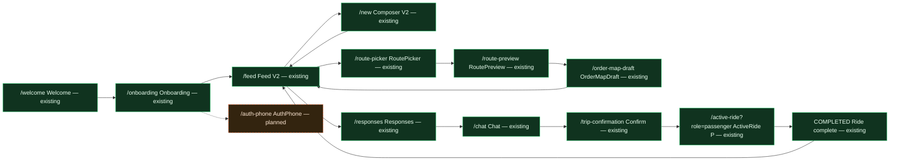

---

## D. Пользовательский путь водителя

```mermaid
flowchart LR
  welcome["/welcome Welcome — existing"]
  onboarding["/onboarding Onboarding — existing"]
  profile["/profile Driver mode — existing"]
  feed["/feed Feed V2 — existing"]
  driverMap["/driver-map DriverMap — existing"]
  respond["/respond Respond — existing"]
  chat["/chat Chat — existing"]
  confirm["/trip-confirmation Confirm — existing"]
  activeRide["/active-ride?role=driver ActiveRide D — existing"]
  complete["COMPLETED Ride complete — existing"]
  earningsSheet["Earnings sheet — existing"]
  earningsScreen["/earnings Earnings — planned"]
  noShow["NO_SHOW full flow — planned"]
  realMap["Real Mapbox layer — blocked"]

  welcome --> onboarding
  onboarding --> profile
  profile --> feed
  profile --> driverMap
  driverMap -.-> realMap
  feed --> respond
  driverMap --> activeRide
  respond --> chat
  chat --> confirm
  confirm --> activeRide
  activeRide --> complete
  activeRide -.-> noShow
  complete --> earningsSheet
  earningsSheet -.-> earningsScreen
  complete --> driverMap

  classDef existing fill:#10331f,stroke:#2ecc71,color:#eafff0;
  classDef planned fill:#33240f,stroke:#FF6B35,color:#ffe9d6,stroke-dasharray:5 3;
  classDef placeholder fill:#1b1b33,stroke:#7d7dff,color:#e9e9ff;
  classDef blocked fill:#331515,stroke:#ff5252,color:#ffe0e0;

  class welcome,onboarding,profile,feed,driverMap,respond,chat,confirm,activeRide,complete,earningsSheet existing;
  class earningsScreen,noShow planned;
  class realMap blocked;
```

---

## E. Слои приложения

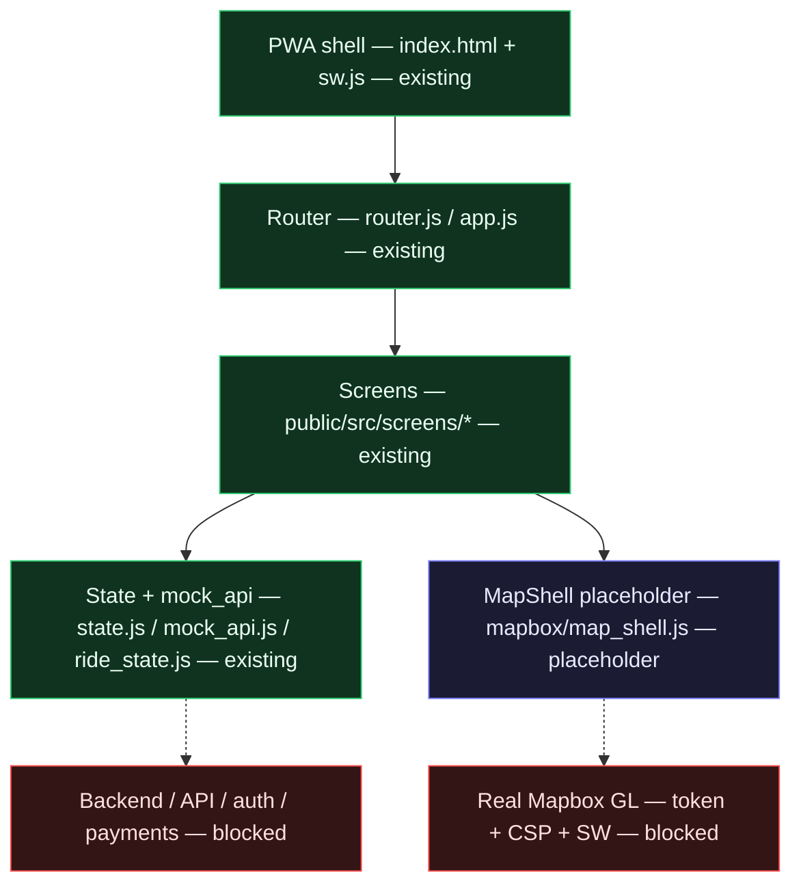

---

## F. Статусы поездки

Источник: `RIDE_STATUS` в `public/src/ride_state.js`. Реальный driver-спайн содержит промежуточные `ACCEPTED` и `DRIVER_APPROACHING_PICKUP` (показаны бледнее для полноты), запрошенный «короткий» спайн выделен зелёным.

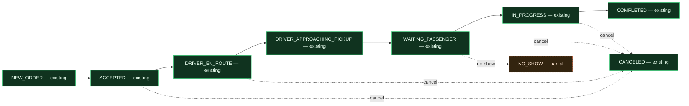

> Зарезервированные/legacy-члены enum `CONFIRMATION_PENDING`, `CONFIRMED`, `CHAT_STARTED` существуют как
> константы, но **не** подключены к state-машине (нет `STATUS_TIMESTAMP_FIELD` / `NEXT_DRIVER_STATUS`).
> Кандидаты на очистку — на схеме не показаны.

---

## 5. Аудит-флаги: что требует внимания

### Реализованы, но требуют Cloud Design audit (render-gate сверки)
Эти экраны есть в коде и попадают в render-gate `BD-RENDER-GATES-2026-06-03` (`design-registry.json`) — их рендер должен периодически сверяться с эталоном:
`Feed V2`, `Profile`, `MapHome`, `RoutePicker`, `RoutePreview`, `OrderMapDraft`, `DriverMap`, `Driver/Passenger Active Ride`, `Trip Confirmation`, `Respond`, `Responses inbox`, а также Safety / Cancel / Ride Complete состояния.

### Есть только как placeholder
- **MapHome** (`/map`) — только `createMapShell()`, без реальной карты.
- **MapShell** (`mapbox/map_shell.js`) — DOM-заглушка карты, переиспользуется везде.
- **DriverMap** (`/driver-map`) и **Active Ride** карты — рисуют MapShell, не реальную карту.

### Нельзя начинать без render/contract
- **AuthPhone** (BD-AUTH-PHONE-01) — нет ни render, ни контракта; зависит от выбора провайдера auth.
- **Driver No-show full flow** (BD-RIDE-D-NOSHOW-01) — нужен контракт ожидания/компенсации и render.
- **Earnings standalone** (BD-EARNINGS-01) — нужен render истории выплат.
- **DriverConfirm standalone** (BD-CONFIRM-DRIVER-01) — нужен контракт, если продукт потребует явный UI-шаг.

### Зависят от Mapbox
- **BD-MAP-FOUND-01** (real Mapbox foundation) — апгрейд `/map`, `/driver-map`, `/active-ride`.
- **driver_markers.js** (BD-MAP-LAYER-01) и **trip_status_layer.js** (BD-MAP-LAYER-02) — отсутствующие map-layer stub-модули.
- Любая реальная геолокация/маршрут/тайлы. Требует CSP + SW обновления вместе.

### Зависят от backend
- **AuthPhone** — реальный вход (Telegram Login / magic-link).
- **Earnings / Payouts** standalone — реальные выплаты.
- Замена всех mock/local stores на API client; реальный server-side ride state, real-time канал для chat/responses/ride status (Phase 2).

---

## 6. Screen Work Selector

Карточка выбора участка работы по ключевым экранам. Используй как чеклист перед стартом PR: что можно трогать, от чего зависишь, что не ломать, какие URL прогнать.

> Поля: **Work slice** — к какому срезу относится; **Touches** — файлы, которые реально правятся; **Upstream** — что должно быть готово до; **Downstream** — что сломаешь/разблокируешь; **Risk** — риск регрессии; **Do not touch** — запретные зоны; **Recommended branch** — паттерн имени ветки.

### BD-FEED-01 — Feed V2
- **Route:** `/feed` · **File:** `public/src/screens/feed.js` · **Role:** common · **Status:** implemented · **Priority:** P0
- **Work slice:** Feed publish loop
- **Touches:** `screens/feed.js`, `mock_api.js` (`listFeedPosts`, `mergeFeedAndRideOrderPosts`, `listRideOrdersAsFeedPosts`)
- **Upstream deps:** `state.js` (роль/onboarded), `mock_api.js` seed + authored + ride-order posts
- **Downstream deps:** Composer (`/new`), Respond (`/respond`), Post detail (`/post`), Chat, accept-флоу
- **Related user flows:** passenger publish, driver accept-from-feed
- **Risk:** medium — единственный экран с FAB; меняет видимость CTA для обеих ролей
- **Do not touch:** FAB-инвариант (`SHOW_FAB` в `router.js`), регистрация маршрутов в `app.js`
- **Acceptance checklist:** route открывается; tab подсвечивается; FAB виден только тут; фильтры работают; нет CSP/inline-регрессий
- **Recommended branch:** `feature/bd-feed-01-<slice>`
- **Recommended next PR:** уточнить empty-state фильтров / порядок merge ride-order постов
- **Test URLs:** `#/feed`

### BD-COMPOSER-01 — Composer V2
- **Route:** `/new` · **File:** `public/src/screens/composer.js` · **Role:** common · **Status:** implemented · **Priority:** P1
- **Work slice:** Feed publish loop
- **Touches:** `screens/composer.js`, `mock_api.js` (`createFeedPost`), storage `bazardrive.draft.v2`
- **Upstream deps:** onboarding (pending-intent), `state.js`
- **Downstream deps:** Feed (новый authored post появляется в ленте)
- **Related user flows:** passenger request, driver offer, marketplace/announcement/service
- **Risk:** medium — автосейв-черновик; не должен затирать другие сторы
- **Do not touch:** ключи кроме `bazardrive.draft.v2`; storage boundary
- **Acceptance checklist:** 5 типов рендерят верные поля; черновик переживает reload; publish чистит черновик и возвращает на `/feed`
- **Recommended branch:** `feature/bd-composer-01-<slice>`
- **Recommended next PR:** валидация полей по типу публикации
- **Test URLs:** `#/new`, `#/new?type=passenger_request`

### BD-MAP-03 — RoutePicker
- **Route:** `/route-picker` · **File:** `public/src/screens/route_picker.js` · **Role:** passenger · **Status:** implemented · **Priority:** P1
- **Work slice:** Passenger route draft
- **Touches:** `screens/route_picker.js`, storage `bazardrive.route_draft.v1`, CSS `route_picker.css`
- **Upstream deps:** LocationPermission (опц.), MapShell placeholder
- **Downstream deps:** RoutePreview (читает route draft), OrderMapDraft
- **Related user flows:** passenger route order
- **Risk:** medium — driver guard редиректит этот route на `/driver-map`
- **Do not touch:** `PASSENGER_ORDER_ROUTES` guard в `router.js`; чистка только `route_draft`, не composer/feed/orders
- **Acceptance checklist:** clear трогает только route draft; swap/clear point/clear all работают; continue → `/route-preview`
- **Recommended branch:** `feature/bd-map-03-<slice>`
- **Recommended next PR:** обработка malformed draft fallback
- **Test URLs:** `#/route-picker`

### BD-MAP-04 — RoutePreview
- **Route:** `/route-preview` · **File:** `public/src/screens/route_preview.js` · **Role:** passenger · **Status:** implemented · **Priority:** P1
- **Work slice:** Passenger route draft
- **Touches:** `screens/route_preview.js` (читает `bazardrive.route_draft.v1`), CSS `route_preview.css`
- **Upstream deps:** RoutePicker (route draft)
- **Downstream deps:** OrderMapDraft (создание заказа)
- **Related user flows:** passenger route order
- **Risk:** low — read-only по draft; цена/ETA из mock
- **Do not touch:** не писать заказ отсюда (это делает OrderMapDraft)
- **Acceptance checklist:** distance/duration/price из local mock; missing/malformed draft → fallback; edit → назад в picker
- **Recommended branch:** `feature/bd-map-04-<slice>`
- **Recommended next PR:** улучшить fallback при пустом draft
- **Test URLs:** `#/route-preview`

### BD-MAP-05 — OrderMapDraft
- **Route:** `/order-map-draft` · **File:** `public/src/screens/order_map_draft.js` · **Role:** passenger · **Status:** implemented · **Priority:** P0
- **Work slice:** Passenger route draft → Driver order accept
- **Touches:** `screens/order_map_draft.js`, storage `bazardrive.order_form.v1` + `bazardrive.ride_orders.v1`, `mock_api.js` (`createRideOrder`)
- **Upstream deps:** RoutePreview (route draft)
- **Downstream deps:** Feed (ride-order как post), DriverMap (`listNearbyOrders`)
- **Related user flows:** passenger route order → driver discovery
- **Risk:** high — точка создания заказа, который тянут feed и driver-map
- **Do not touch:** схема `ride_orders.v1` без согласования с `mock_api.js`/driver-map
- **Acceptance checklist:** publish всегда даёт видимый feedback и не падает молча; now/later/price/comment работают
- **Recommended branch:** `feature/bd-map-05-<slice>`
- **Recommended next PR:** валидация формы заказа
- **Test URLs:** `#/order-map-draft`

### BD-DRIVER-01/02 — DriverMap
- **Route:** `/driver-map` · **File:** `public/src/screens/driver_map.js` · **Role:** driver · **Status:** partial · **Priority:** P0
- **Work slice:** Driver order accept
- **Touches:** `screens/driver_map.js`, `mock_api.js` (`listNearbyOrders`, `acceptNearbyOrder`), `ride_actions.js` (`acceptCanonicalRideOrder`), `state.js` (`isDriverLineReady`), CSS `driver_sheets.css`
- **Upstream deps:** OrderMapDraft (заказы), Profile readiness (gate)
- **Downstream deps:** Active Ride driver (handoff через `seedActiveRideFromAcceptedOrder`)
- **Related user flows:** driver order accept, driver readiness
- **Risk:** high — двойной gate (role + readiness), canonical accept-флоу
- **Do not touch:** правило `isDriverLineReady()` (общий источник в `state.js`); MapShell-only (не подключать Mapbox)
- **Acceptance checklist:** ready → список/accept; not_ready → gate без accept; non_driver → passenger fallback; smoke `smoke-driver-map-readiness.mjs` + `smoke-driver-map-accept-handoff.mjs` зелёные
- **Recommended branch:** `feature/bd-driver-02-<slice>`
- **Recommended next PR:** улучшить accepted-handoff UI
- **Test URLs:** `#/driver-map`

### BD-RESPOND-01 — Respond
- **Route:** `/respond?postId=…` · **File:** `public/src/screens/respond.js` · **Role:** driver/passenger · **Status:** implemented · **Priority:** P1
- **Work slice:** Chat / handoff flow
- **Touches:** `screens/respond.js`, storage `bazardrive.respond.v1` (+ иногда `bazardrive.responses.v1`)
- **Upstream deps:** Feed (postId)
- **Downstream deps:** Chat, Responses inbox (read-side подключён — #369)
- **Related user flows:** offer на заявку
- **Risk:** medium — write-side линкует `orderId`; read-side в `/responses` подключён (#369)
- **Do not touch:** write-side контракт (`orderId`+`canonical` только для canonical-постов; respond → chat link без `orderId`)
- **Acceptance checklist:** offer-форма + vehicle card; submitted state; данные локальные
- **Recommended branch:** `feature/bd-respond-01-<slice>`
- **Recommended next PR:** захват driver identity (имя/рейтинг/авто) в `passenger_response` — отдельный issue
- **Test URLs:** `#/respond?postId=trip-2`

### BD-CHAT-01 — Chat
- **Route:** `/chat?tripId=… | ?responseId=…` · **File:** `public/src/screens/chat.js` · **Role:** common · **Status:** implemented · **Priority:** P1
- **Work slice:** Chat / handoff flow
- **Touches:** `screens/chat.js`, storage `bazardrive.chat.v1`, `bazardrive.responses.v1`, `bazardrive.trip_confirmation.v1`
- **Upstream deps:** Feed/Respond/Responses/Inbox (источники tripId/responseId)
- **Downstream deps:** Trip Confirmation, Active Ride
- **Related user flows:** координация поездки, мост к confirmation
- **Risk:** high — `bazardrive.chat.v1` пишется из нескольких модулей (риск drift)
- **Do not touch:** централизованную миграцию `chat.v1`; не плодить параллельные сторы
- **Acceptance checklist:** один `tripId` связывает feed/respond/confirmation/active ride; smoke `smoke-chat-handoff.mjs` зелёный
- **Recommended branch:** `feature/bd-chat-01-<slice>`
- **Recommended next PR:** quick-replies / confirmation CTA edge-cases
- **Test URLs:** `#/chat?tripId=trip-2`, `#/chat?responseId=r1`

### BD-RIDE-D-01..09 — Active Ride (driver)
- **Route:** `/active-ride?role=driver` · **File:** `public/src/screens/active_ride.js` · **Role:** driver · **Status:** implemented · **Priority:** P0
- **Work slice:** Active ride driver
- **Touches:** `screens/active_ride.js`, `ride_state.js`, `mock_api.js` (`updateTripStatus`, `findLatestHandedOffOrderTripId`), `driver_handoff_snapshot.js`, CSS `driver_sheets.css`
- **Upstream deps:** DriverMap accept / Trip Confirmation handoff
- **Downstream deps:** ride history, canonical ride order status, earnings sheet
- **Related user flows:** driver lifecycle, cancel/problem/earnings/no-show
- **Risk:** high — state-машина + canonical sync; защищён инвариантами в `check.mjs`
- **Do not touch:** переходы статусов мимо `ride_state.js`; не дублировать passenger-рендер; инварианты `tripId`-резолва в `check.mjs`
- **Acceptance checklist:** статусы идут через `ride_state.js`; canonical order sync (in-progress/completed/canceled); NO_SHOW → CANCELED canonical
- **Recommended branch:** `feature/bd-ride-d-<slice>`
- **Recommended next PR:** полноценный no-show flow (см. BD-RIDE-D-NOSHOW-01)
- **Test URLs:** `#/active-ride?role=driver&status=ACCEPTED`, `…&status=DRIVER_EN_ROUTE`, `…&status=WAITING_PASSENGER`, `…&status=IN_PROGRESS`, `…&status=COMPLETED`, `…&status=CANCELED`

### BD-RIDE-P-01..07 — Active Ride (passenger)
- **Route:** `/active-ride?role=passenger` · **File:** `public/src/screens/active_ride_passenger.js` · **Role:** passenger · **Status:** implemented · **Priority:** P0
- **Work slice:** Active ride passenger
- **Touches:** `screens/active_ride_passenger.js` (читает тот же `bazardrive.active_ride.v1`)
- **Upstream deps:** тот же tripId, что у driver-вью; `active_ride.js` диспетчит role
- **Downstream deps:** cancel/safety sheets, done/new ride CTA
- **Related user flows:** passenger tracking, cancel/safety
- **Risk:** medium — общий store с driver; query-params только для QA-симуляции
- **Do not touch:** не вводить отдельный `/active-ride-passenger` route; не менять status enum
- **Acceptance checklist:** тот же tripId/enum, role-specific UI; smoke `smoke-passenger-active-ride.mjs` зелёный
- **Recommended branch:** `feature/bd-ride-p-<slice>`
- **Recommended next PR:** safety-sheet контент / dropoff sub-phase
- **Test URLs:** `#/active-ride?role=passenger&status=DRIVER_EN_ROUTE`, `…&status=WAITING_PASSENGER&phase=ARRIVING_DROPOFF`, `…&status=COMPLETED&payment=paid`, `…&status=CANCELED`

### BD-PROFILE-01/02 — Profile
- **Route:** `/profile` · **File:** `public/src/screens/profile.js` · **Role:** passenger + driver · **Status:** implemented · **Priority:** P0
- **Work slice:** Profile readiness / Auth & phone verification
- **Touches:** `screens/profile.js`, `state.js` (`isDriverLineReady`, `setDocumentStatus`, derived flags)
- **Upstream deps:** Onboarding (роль/документы)
- **Downstream deps:** DriverMap gate, Feed/Post accept CTA (readiness), phone-verify banner
- **Related user flows:** driver readiness, passenger phone verification
- **Risk:** high — readiness-правило шарится с driver-map; документы влияют на gate
- **Do not touch:** единый `isDriverLineReady()` (не форкать в profile); document-derived flags
- **Acceptance checklist:** guest/passenger не видят driver-only; readiness gates accept-поверхности; smoke `smoke-driver-docs-readiness.mjs` зелёный
- **Recommended branch:** `feature/bd-profile-<slice>`
- **Recommended next PR:** реальная phone-верификация (зависит от backend, AuthPhone)
- **Test URLs:** `#/profile`

---

## 7. Work Slice Matrix

Минимальные срезы работы. Каждый срез — изолируемый кусок, который можно взять в один PR.

| Work slice | Main screen | Route | Primary files | Required state | Required mock_api | Depends on | Unlocks | Risk | Suggested branch | Test URLs |
|---|---|---|---|---|---|---|---|---|---|---|
| Feed publish loop | Feed V2 | `/feed`, `/new` | `feed.js`, `composer.js` | `bazardrive.draft.v2`, `bazardrive.myposts.v1` | `listFeedPosts`, `createFeedPost`, `mergeFeedAndRideOrderPosts` | onboarding, `state.js` | Respond, Chat, accept-флоу | medium | `feature/feed-publish-loop` | `#/feed`, `#/new` |
| Passenger route draft | RoutePicker → OrderMapDraft | `/route-picker`, `/route-preview`, `/order-map-draft` | `route_picker.js`, `route_preview.js`, `order_map_draft.js` | `route_draft.v1`, `order_form.v1`, `ride_orders.v1` | `createRideOrder` | MapShell, LocationPermission | Driver order accept | high | `feature/passenger-route-draft` | `#/route-picker`, `#/route-preview`, `#/order-map-draft` |
| Driver order accept | DriverMap | `/driver-map` | `driver_map.js`, `ride_actions.js` | `ride_orders.v1`, `active_ride.v1` | `listNearbyOrders`, `acceptOrder`, `acceptCanonicalRideOrder` | Passenger route draft, Profile readiness | Active ride driver | high | `feature/driver-order-accept` | `#/driver-map` |
| Active ride passenger | Active Ride P | `/active-ride?role=passenger` | `active_ride_passenger.js` | `active_ride.v1` | `getActiveRide`, `updateActiveRideStatus` | Driver order accept / handoff | Ride complete passenger | medium | `feature/active-ride-passenger` | `#/active-ride?role=passenger&status=DRIVER_EN_ROUTE` |
| Active ride driver | Active Ride D | `/active-ride?role=driver` | `active_ride.js`, `ride_state.js`, `driver_handoff_snapshot.js` | `active_ride.v1`, `ride_history.v1`, `driver_handoff_snapshot.v1` | `updateTripStatus`, `findLatestHandedOffOrderTripId` | Driver order accept | Earnings, ride history, no-show | high | `feature/active-ride-driver` | `#/active-ride?role=driver&status=IN_PROGRESS` |
| Mapbox foundation | MapHome / DriverMap / ActiveRide | `/map`, `/driver-map`, `/active-ride` | `mapbox/*` (new), `map_shell.js` | `map_prefs.v1` | — | **blocked:** Mapbox SDK + CSP + SW | реальная карта/маршрут/маркеры | high (blocked) | `feature/mapbox-foundation` | `#/map`, `#/driver-map` |
| Profile readiness | Profile (driver) | `/profile` | `profile.js`, `state.js` | `bazardrive.user.v1` (docs/derived flags) | — | Onboarding | DriverMap gate, accept CTA | high | `feature/profile-readiness` | `#/profile` |
| Chat / handoff flow | Chat → Confirm → Active | `/chat`, `/trip-confirmation` | `chat.js`, `trip_confirmation.js`, `trip_confirmation_handoff.js` | `chat.v1`, `responses.v1`, `trip_confirmation.v1` | — | Respond/Responses/Feed | Active ride seed | high | `feature/chat-handoff-flow` | `#/chat?tripId=trip-2`, `#/trip-confirmation` |
| Auth / phone verification | Profile / Onboarding (AuthPhone) | `/profile`, `/onboarding`, `/auth-phone` (planned) | `profile.js`, `onboarding.js`, `auth_phone.js` (new) | `bazardrive.user.v1` (`phoneVerified`) | — | **blocked:** backend auth | реальный вход/верификация | high (blocked) | `feature/auth-phone-verification` | `#/profile`, `#/onboarding` |
| Driver no-show flow | Active Ride D | `/active-ride?role=driver&status=NO_SHOW` | `active_ride.js`, `ride_state.js` | `active_ride.v1` | `updateTripStatus` | Active ride driver | полноценный no-show lifecycle | medium | `feature/driver-no-show-flow` | `#/active-ride?role=driver&status=WAITING_PASSENGER` |

---

## 8. Impact Graph

Графы влияния по ключевым экранам: что экран читает (upstream) и что от него зависит (downstream). Под каждым — что можно/нельзя, какие файлы тянутся, какие URL прогнать.

### `/feed` — Feed V2

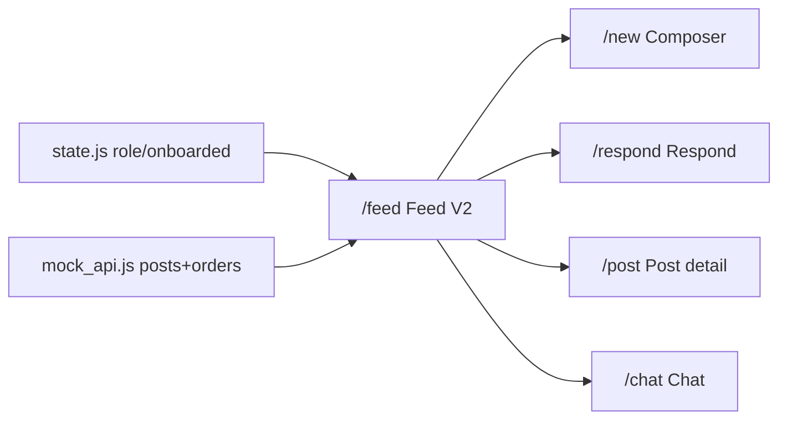

- **Можно:** менять рендер карточек/категорий/empty-state, порядок merge ride-order постов.
- **Нельзя:** трогать FAB-инвариант, регистрацию маршрутов в `app.js`, ключи сторов.
- **Тянет файлы:** `feed.js`, `mock_api.js`, `state.js`.
- **Проверить URL:** `#/feed`.

### `/new` — Composer V2

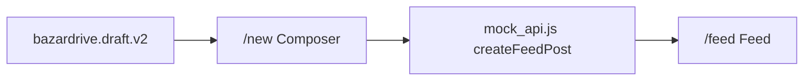

- **Можно:** поля по типу публикации, валидацию, автосейв-логику в рамках `draft.v2`.
- **Нельзя:** писать чужие ключи; ломать pending-intent из onboarding.
- **Тянет файлы:** `composer.js`, `mock_api.js`.
- **Проверить URL:** `#/new`, `#/new?type=passenger_request`.

### `/route-picker` — RoutePicker

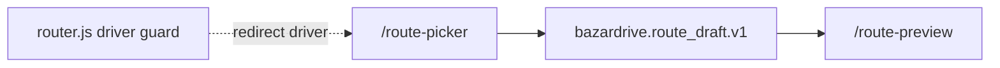

- **Можно:** UX выбора pickup/dropoff, swap/clear, fallback malformed draft.
- **Нельзя:** трогать `PASSENGER_ORDER_ROUTES` guard; чистить composer/feed/orders.
- **Тянет файлы:** `route_picker.js`, CSS `route_picker.css`.
- **Проверить URL:** `#/route-picker`.

### `/route-preview` — RoutePreview

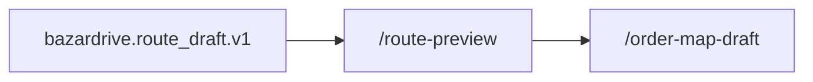

- **Можно:** отображение distance/duration/price из mock, edit-возврат в picker.
- **Нельзя:** создавать заказ отсюда; писать в `ride_orders.v1`.
- **Тянет файлы:** `route_preview.js`, CSS `route_preview.css`.
- **Проверить URL:** `#/route-preview`.

### `/order-map-draft` — OrderMapDraft

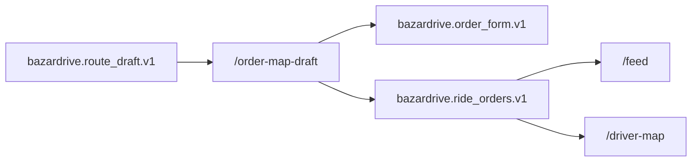

- **Можно:** валидацию формы, now/later/price/comment, success-feedback.
- **Нельзя:** менять схему `ride_orders.v1` без согласования с `mock_api.js`/driver-map.
- **Тянет файлы:** `order_map_draft.js`, `mock_api.js`, CSS `order_map_draft.css`.
- **Проверить URL:** `#/order-map-draft`.

### `/driver-map` — DriverMap

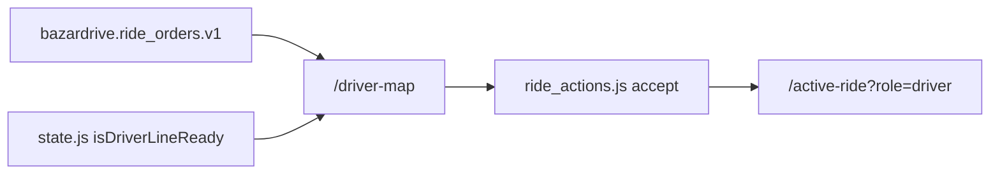

- **Можно:** order list/empty/accepted-handoff UI, not_ready gate copy.
- **Нельзя:** форкать `isDriverLineReady()`; подключать Mapbox (MapShell-only).
- **Тянет файлы:** `driver_map.js`, `mock_api.js`, `ride_actions.js`, `state.js`, CSS `driver_sheets.css`.
- **Проверить URL:** `#/driver-map`.

### `/respond` — Respond

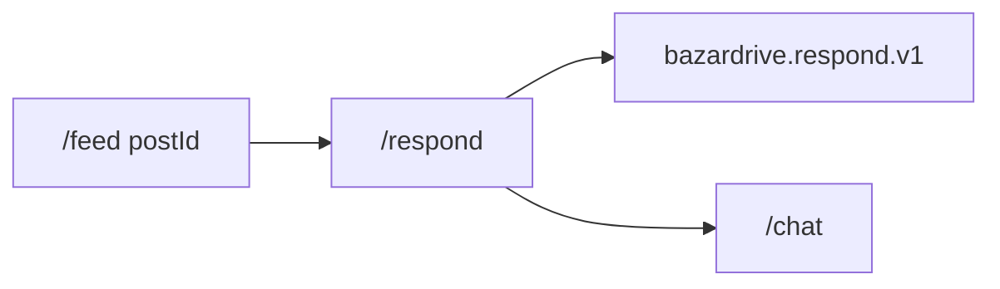

- **Можно:** offer-форму, vehicle card, submitted state.
- **Нельзя:** менять write-side контракт; respond → chat link без `orderId`. (Read-side в `/responses` подключён — #369.)
- **Тянет файлы:** `respond.js`.
- **Проверить URL:** `#/respond?postId=trip-2`.

### `/chat` — Chat

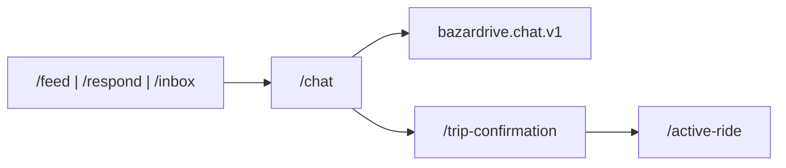

- **Можно:** тред, quick-replies, confirmation CTA в рамках `chat.v1`.
- **Нельзя:** плодить параллельные чат-сторы; ломать централизованную миграцию `chat.v1`.
- **Тянет файлы:** `chat.js`, `trip_confirmation.js`.
- **Проверить URL:** `#/chat?tripId=trip-2`, `#/chat?responseId=r1`.

### `/active-ride?role=driver` — Active Ride (driver)

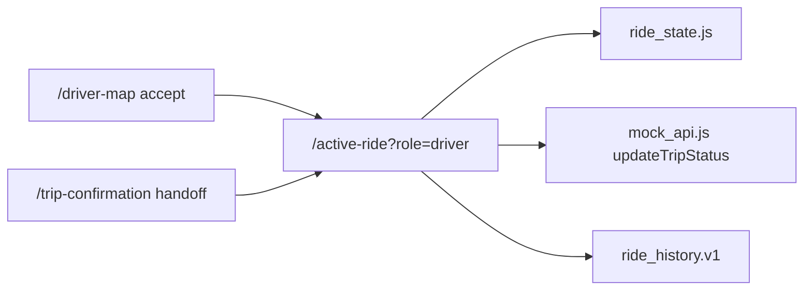

- **Можно:** lifecycle UI, sheets (cancel/problem/earnings), no-show flow.
- **Нельзя:** менять статусы мимо `ride_state.js`; дублировать passenger-рендер; ломать инварианты `tripId`-резолва в `check.mjs`.
- **Тянет файлы:** `active_ride.js`, `ride_state.js`, `mock_api.js`, `driver_handoff_snapshot.js`, CSS `driver_sheets.css`.
- **Проверить URL:** `#/active-ride?role=driver&status=ACCEPTED` … `&status=COMPLETED`, `&status=CANCELED`.

### `/active-ride?role=passenger` — Active Ride (passenger)

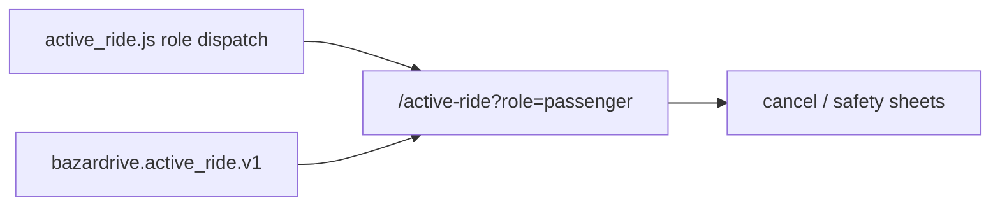

- **Можно:** passenger tracking UI, cancel/safety sheets, dropoff sub-phase.
- **Нельзя:** вводить отдельный `/active-ride-passenger` route; менять status enum; писать driver-поля.
- **Тянет файлы:** `active_ride_passenger.js` (читает тот же store).
- **Проверить URL:** `#/active-ride?role=passenger&status=WAITING_PASSENGER&phase=ARRIVING_DROPOFF`, `…&status=COMPLETED&payment=paid`.

### `/profile` — Profile

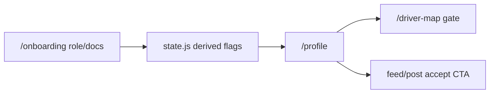

- **Можно:** dashboard-вкладки, readiness checklist, document mock-статусы, verify-banner.
- **Нельзя:** форкать `isDriverLineReady()`; реальная phone-верификация (нужен backend).
- **Тянет файлы:** `profile.js`, `state.js`.
- **Проверить URL:** `#/profile`.

---

## 9. Ограничения (что НЕ делает этот документ)

```text
no backend API
no real Mapbox SDK
no APK / TWA
no inline script/style/on* handlers
no CSP weakening
не меняет index.html / app.js / router.js / CSS / Service Worker
не добавляет новые экраны и маршруты
```

Этот файл — только документация. Связанные источники правды: `screen-contracts.md`, `flow-contracts.md`, `active-ride-plan.md`, `design-registry.json`, `ROADMAP.md`.
</content>
</invoke>
